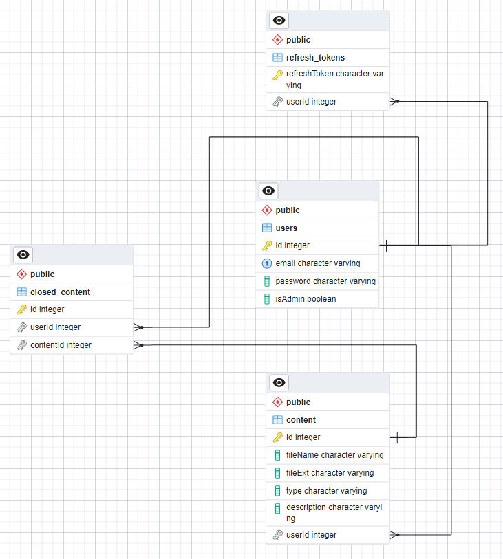

# GALLERY INTERNSHIP TASK
[NodeJS](http://nodejs.org) backend application: a gallery of images/videos of users with the ability
to distribute access permissions.

## Task
Link to a file with full task: [gallery_internship_task.pdf](./gallery_internship_task.pdf)

## How to run the app
Instructions for installing modules and launching
the application:
1. Clone project from repository to your working folder
```
git clone https://github.com/alex-gudkov-innowise/GALLERY_INTERNSHIP_TASK.git
```

2. Open your working folder in terminal and install all required modules
```TXT
npm install
```
4. Create .ENV file and declare environment variables (for getting variables in development mode – .DEV.ENV file, for production mode – .PROD.ENV file). All used environment variables  are listed below
```
PORT

POSTGRES_HOST
POSTGRES_PORT
POSTGRES_USERNAME
POSTGRES_PASSWORD
POSTGRES_DATABASE

ACCESS_TOKEN_SECRET
ACCESS_TOKEN_EXPIRES_IN

REFRESH_TOKEN_SECRET
REFRESH_TOKEN_EXPIRES_IN

IMAGE_EXTENSIONS
VIDEO_EXTENSIONS

MAIN_ADMIN_MAIL
MAIN_ADMIN_PASSWORD
MAIN_ADMIN_NAME

MAILER_HOST
MAILER_PORT
MAILER_IS_SECURE
MAILER_USER
MAILER_PASS
MAILER_FROM

CONFIRMATION_TOKEN_SECRET
CONFIRMATION_TOKEN_EXPIRES_IN
```

5. Run the application (development mode)
```
npm run start:dev
```

File [index.html](./index.html) is need to stream the videos on Frontend. Images are served as static so you get the direct link. 

## Database
Main entities:
* users
* content
* roles
* refresh_tokens

Relationships entities:
* user_roles
* closed_content

Current database schema:



## Application stack
Description of the technology stack used in the application:
* Programing language – [TypeScript](http://www.typescriptlang.org)
* Framework – [NestJS](https://nestjs.com/)
* Database – [PostgreSQL](https://www.postgresql.org/)
* ORM tool – [TypeORM](https://typeorm.io/)

