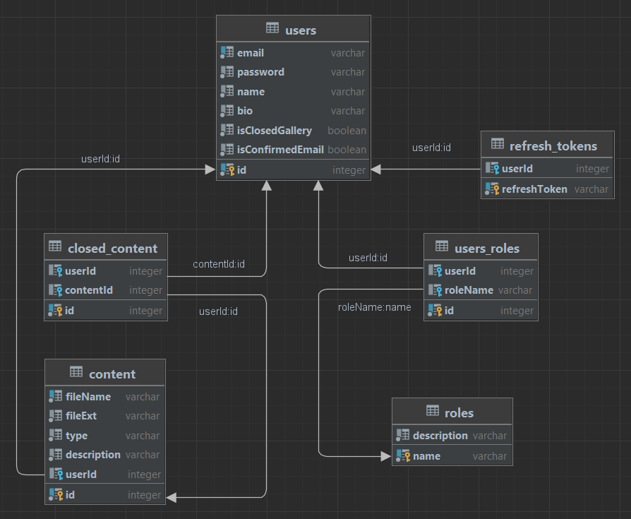

# GALLERY INTERNSHIP TASK

NodeJS backend application: a gallery of images/videos of users with the ability
to distribute access permissions. Framework – NestJS, database – PostgreSQL, ORM – TypeORM.

Current database schema:

